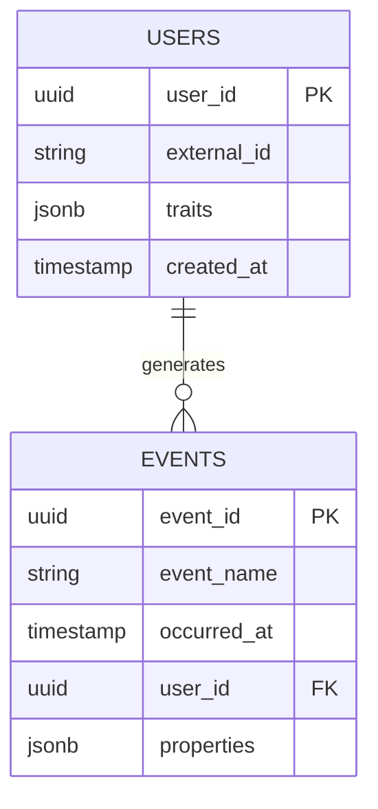

# データモデル設計

## ER図

<!-- Mermaid 等で記述 -->

## テーブル一覧

| テーブル名 | 説明 |
|-----------|------|
| users | ユーザーマスタ |
| events | イベントログ |
| sessions | セッション情報 |

## 主要テーブル詳細

### users

| カラム | 型 | NULL | 説明 |
|--------|---|------|------|
| user_id | UUID | NOT NULL | 主キー |
| external_id | VARCHAR | NULL | 外部システムのユーザーID |
| traits | JSONB | NULL | ユーザー属性 |
| created_at | TIMESTAMPTZ | NOT NULL | 作成日時 |
| updated_at | TIMESTAMPTZ | NOT NULL | 更新日時 |

### events

| カラム | 型 | NULL | 説明 |
|--------|---|------|------|
| event_id | UUID | NOT NULL | 主キー |
| event_name | VARCHAR | NOT NULL | イベント名 |
| user_id | UUID | NULL | ユーザーID |
| session_id | UUID | NULL | セッションID |
| properties | JSONB | NULL | イベント固有プロパティ |
| occurred_at | TIMESTAMPTZ | NOT NULL | イベント発生日時 |
| received_at | TIMESTAMPTZ | NOT NULL | サーバー受信日時 |

## インデックス戦略

<!-- パフォーマンス要件に基づくインデックス設計 -->

## パーティション戦略

<!-- データ量に応じたパーティション方針 -->
